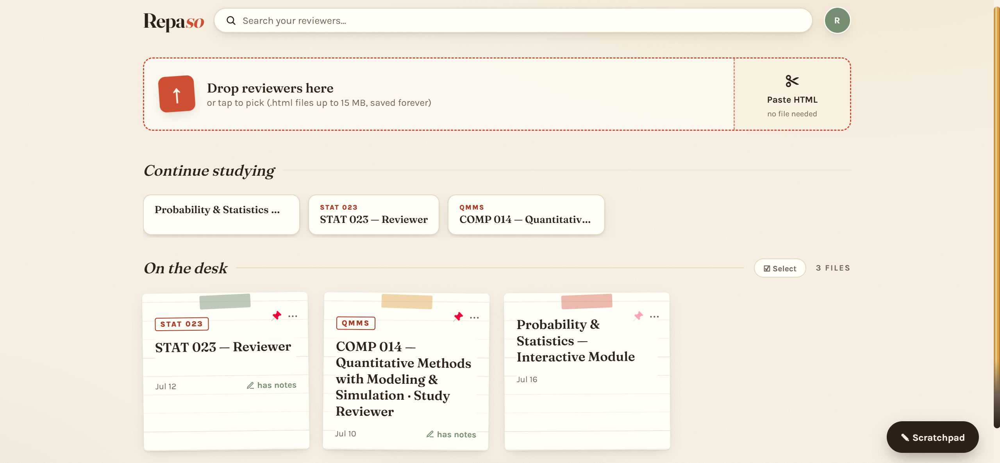
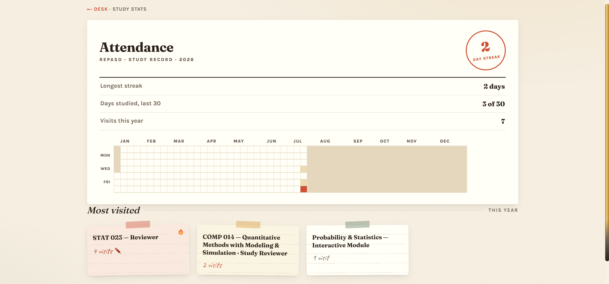
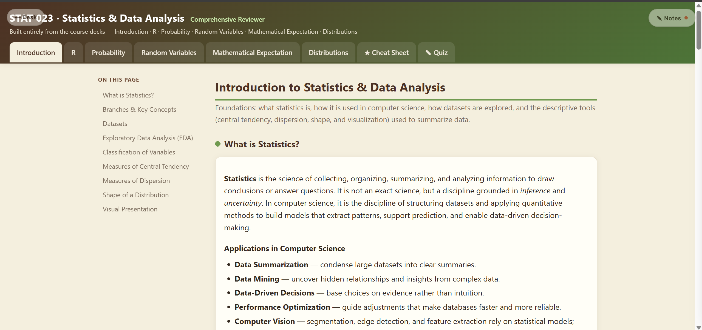
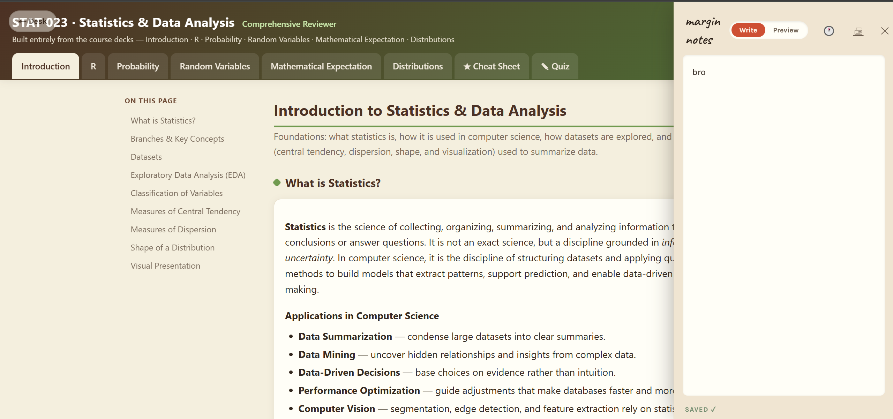
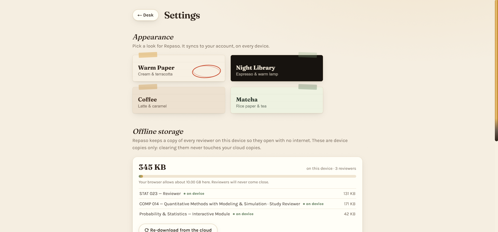

# Repaso

Repaso is my personal study app. I make single-file HTML reviewers (usually with an AI, one per subject), upload them here, and open them from any device with one tap. Every reviewer stays in the cloud so nothing gets lost, and each one has its own notes drawer for margin notes while I study.

It is built to run at **zero cost, forever**, on free tiers only, with no card on file anywhere. It signs in once per device with Google and only my account is allowed in.

**Live:** [repaso-six.vercel.app](https://repaso-six.vercel.app) (single-user, allow-listed)

## Why I built this

I make a lot of reviewers, usually more than one per subject, so I kept ending up with several versions of the same thing. They piled up in my downloads folder until finding the right one meant scrolling past every file I had ever saved. When I could not find one, it was easier to just make a new one, which only made the pile worse. Then I would have to work out which session I even made the original in.

What actually pushed me to build it was exams. I would make a reviewer on my laptop and forget to send it to my phone, and I do not bring a laptop to exams. So I would be on campus trying to pull it up on my phone, on school wifi shared with a few thousand other students, on a phone that is not new. Plenty of times it just would not load. I would end up reviewing from an older version or from whatever course material I still had saved, which is a bad place to be an hour before a test.

Repaso exists so that does not happen again. Every reviewer is already on my phone before I need it, and it opens with no internet at all.

## What it does

- **Upload reviewers** by dropping `.html` files or pasting HTML directly. Files up to 15 MB, stored compressed so they stay small.
- **Open anywhere** as an installed app on phone or laptop. The reviewer fills the screen in a sandboxed frame, so any quizzes or interactivity inside it still work.
- **Notes** on every reviewer plus a global scratchpad, with a written/preview toggle, version history, and a printable sheet.
- **Local-first.** The whole app works with no internet: read reviewers, write notes, upload new ones, rename, pin, archive, delete. Everything backs up to the cloud on its own once a connection returns. This matters because I do not always have signal at school.
- **Organize** with search (including search inside a reviewer's text), pins, subjects, an archive drawer, and bulk actions.
- **Share** a single reviewer with a private link that anyone can open read-only, no sign-in, and that I can turn off anytime.
- **Study stats.** A study record with streaks, days studied, a year calendar of when I opened things, and my most-visited reviewers.
- **Themes.** Four looks (Warm Paper, Night Library, Coffee, Matcha) that sync to my account, each with its own matching custom scrollbars.
- **Backups.** Export everything to one JSON file and restore from it later. The backup is plain readable HTML, so it never depends on the app to open.

## Stack

- **Next.js** (App Router) and **TypeScript**
- **Neon** Postgres with **Drizzle ORM**
- **Auth.js** with Google sign-in
- **Vercel** for hosting (auto-deploys on push to `main`)
- Installable **PWA** with an offline service worker

Everything sits on a no-card free tier. This was picked on purpose over options that need a card or pause the database.

## How the offline part works

The device is the source of truth. Every reviewer and note lives in the browser's IndexedDB, so the desk, viewer, and notes all open instantly whether or not there is a connection. Writes apply to the local copy first, then join an ordered outbox queue that pushes them to Neon whenever the network is available. The cloud is the backup and the bridge between my phone and laptop. If two devices ever edit the same note, both versions are kept rather than one being dropped. The full write-up is in [`docs/local-first-upgrade-path.md`](docs/local-first-upgrade-path.md).

## Running it yourself

```bash
npm install
npm run dev
```

Open [http://localhost:3000](http://localhost:3000). Before running, copy `.env.example` to `.env.local` and fill in:

- `DATABASE_URL`: a Neon Postgres connection string
- `AUTH_SECRET`: any random secret for Auth.js
- `AUTH_GOOGLE_ID` and `AUTH_GOOGLE_SECRET`: a Google OAuth client
- `ALLOWED_EMAIL`: the one email allowed to sign in

Useful scripts:

```bash
npm run test    # run the test suite
npm run lint    # lint
npm run build   # production build
```

App icons regenerate from inline SVGs in one pass:

```bash
node scripts/make-icons.mjs
```

## How it was built

Repaso grew one version at a time, from a first working upload-and-view app to a full local-first study tool. Each version started as a written spec and plan, got built and reviewed piece by piece, and shipped only after passing a full review. The design language is a warm paper desk: ruled index cards, washi tape, stamps, and handwritten margin notes, kept consistent across every screen.

## What I learned

**Free infrastructure is real.** I went in assuming something this convenient had to start charging me eventually. It does not. Neon, Vercel, and Google sign-in all have free tiers that a single-user app never comes close to outgrowing. Choosing the stack around that limit, instead of reaching for whatever was easiest and putting a card down, was the first real architecture decision I made. I also set up the Google Cloud OAuth client myself, which sounded intimidating and turned out to be mostly following the steps carefully.

**Syncing is much harder than it looks.** If you had asked me before this, I would have said keeping a copy on the device is basically just saving the file twice. It became the single biggest version in the project. Two devices editing the same note, a phone that drops signal halfway through a save, a tab closed before a change finishes uploading: every one of those is a way to quietly lose work, and each one needs its own answer. Finding out how much sits underneath something that looks this simple was the most interesting part of the build.

**I should have researched first.** I never properly tried Drive, Notion, or anything else before deciding to build my own. It worked out, but looking at what already exists is a real step and I skipped it. I would not skip it again.

## How I used AI

I want to be straight about this, because I think how someone uses these tools says more than whether they used them.

I did not write the code. Claude did. What I did was decide what this thing had to be, and refuse to accept it until it was that.

That meant setting the rules it had to build inside: zero cost forever, no card anywhere, sign in once per device, and data that never disappears. It meant making the design calls, including throwing out an entire stats page because it had drifted into generic rounded cards that looked nothing like the rest of the app, and having it rebuilt in the app's own paper language. It meant pushing back when work kept getting split into smaller pieces than I wanted. And it meant being the one who tested every version on a real phone and a real laptop, which is the part that cannot be handed off.

Some things I picked up along the way:

**Reviewing everything myself did not scale.** At the start I checked all the output by hand. I still missed things, and catching a problem late always cost more than catching it early. So I read up on it and moved to a loop where the work gets reviewed in passes before it ever reaches me. That change did more for quality than anything else I tried. It caught real bugs, including ones that would have silently lost my notes. My job turned into setting the goal and doing the final real-world test.

**Prototypes before code.** Asking for a few complete versions of a screen and choosing between them works far better than trying to describe what I want in words. Most of the time I do not know exactly what I want until I can see the options side by side.

**The tool has habits you have to correct.** Left to its own defaults it drifts toward designs that look like every other generated site, and it kept wanting to break work into smaller chunks than made sense. Knowing those tendencies and pushing against them is most of the skill.

None of this is me saying the tool is flawless. It made mistakes, some of them the kind that would have cost me my notes, and the ones that mattered got caught because there was a process built to catch them. But it also built something in two weeks that I could not have built alone in a semester. I think knowing how to direct it well, and how to check it properly, is going to be a normal expectation rather than an advantage.

## Screenshots

| | |
|:--:|:--:|
| **The desk** | **Study stats** |
|  |  |
| **A reviewer, open** | **Margin notes** |
|  |  |

**Themes and offline storage**


